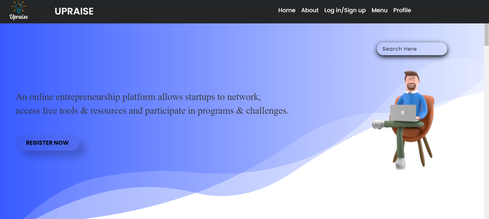

# UPRAISE

## Overview:
UPRAISE is a dynamic and comprehensive platform designed to empower startup incubators with essential tools, industry mentorship, and valuable networking opportunities. This platform serves as a one-stop solution for entrepreneurs, streamlining the startup process and significantly enhancing support for new ventures. By integrating advanced resources and expert guidance, UPRAISE helps startups reduce their time to market by up to 20%. The platform was developed with a focus on delivering a seamless experience for users, ensuring that all project milestones were met on time and that the platform operates efficiently to meet the needs of modern entrepreneurs. The project was led with meticulous planning and coordination, ensuring that the development process was smooth and that every feature was implemented with precision.

## Screenshot:

- **Homepage:**



## Features 🔥
- Industry mentorship for startup incubators.
- Networking opportunities with industry experts.
- Essential tools to streamline the startup process.
- Efficient time management, reducing startup time by up to 20%.

## Technology Stack ⚒️
- **Frontend:** HTML, CSS, JavaScript, ReactJS
- **Backend:** PHP, MySQL
- **Additional Tools:** Git, GitHub for version control

<h3 align="center">

</h3>

## Installation 

### Prerequisites -
- XAMPP/WAMP (for PHP and MySQL)
- Composer (for PHP dependencies, if needed)

### Steps -
1. Clone the repository:
   ```bash
   git clone https://github.com/Aditya-Mohite/UPRAISE_.git

2. Start the XAMPP control panel and ensure Apache and MySQL are running.
3. Access phpMyAdmin via http://localhost/phpmyadmin/
4. Create a new database (e.g., website_db).
5. Import the provided SQL file into this database.
6. Update the database configuration in the config.php file with your database name, username, and password.
7. Place the backend files in the htdocs directory within your XAMPP installation (e.g., C:\xampp\htdocs\upraise-website).
8. Ensure that the main.html file is in the root directory of the project, as it is the entry point for the application.

---------------

```javascript

if (youEnjoyed) {

    starThisRepository();
}

```

---------------
